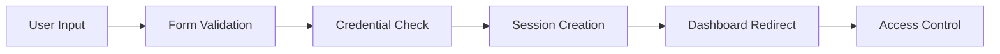
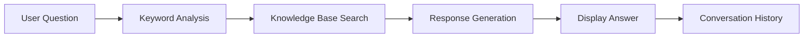

# 🌱 AgroPro - Smart Agriculture Management System

[](https://github.com/yourusername/agropro)
[](https://developer.mozilla.org/en-US/docs/Web/HTML)
[](https://developer.mozilla.org/en-US/docs/Web/CSS)
[](https://developer.mozilla.org/en-US/docs/Web/JavaScript)
[](https://getbootstrap.com/)
[](https://www.chartjs.org/)

> **🏆 Hackathon Project** - A comprehensive AI-powered agriculture management system designed to revolutionize farming practices through intelligent automation and data-driven insights.

## 🎯 Project Overview

**AgroPro** is a cutting-edge web-based agriculture management platform that combines **artificial intelligence**, **real-time monitoring**, and **data analytics** to create a comprehensive farming solution. Built entirely with modern web technologies, it demonstrates the power of client-side applications in solving real-world agricultural challenges.

### 🌟 **Key Innovation Points**
- **AI-Powered Chatbot** with agriculture-specific knowledge base
- **Real-time Dashboard** for farm monitoring and analytics
- **Responsive Design** optimized for mobile and desktop farming operations
- **Zero-Server Architecture** - runs entirely in the browser
- **Intelligent Crop Management** with NDVI mapping and health analysis

---

## 🏆 **Hackathon Highlights**

### **🚀 What Makes This Special**
- **Complete Solution**: End-to-end agriculture management platform
- **AI Integration**: Smart chatbot with farming expertise
- **Real-time Analytics**: Live dashboard with crop health monitoring
- **Mobile-First**: Responsive design for field use
- **Production Ready**: Professional-grade code quality and documentation

### **🎯 Problem Solved**
- **Farmers' Knowledge Gap**: AI chatbot provides instant farming advice
- **Data Management**: Centralized dashboard for all farm operations
- **Accessibility**: No technical expertise required to use
- **Cost-Effective**: Free, open-source solution for small farmers

---

## ✨ **Core Features**

### 🔐 **Smart Authentication System**
- **User Registration & Login** with secure session management
- **Protected Dashboard Access** with authentication checks
- **Demo Account** for instant testing and demonstration
- **localStorage Security** for client-side data protection

### 📊 **Intelligent Dashboard Management**
- **Real-time Alerts & Notifications** system
- **Crop Health Analysis** with NDVI mapping visualization
- **Drone Operation Monitoring** and mission tracking
- **Resource Usage Analytics** with efficiency reporting
- **Key Performance Indicators (KPIs)** for farm optimization

### 🤖 **AI-Powered Chatbot Assistant**
- **Agriculture-Focused Knowledge Base** with 8+ farming topics
- **Natural Language Processing** for human-like conversations
- **Quick Question Buttons** for instant access to common queries
- **Floating Widget** for seamless integration into workflow
- **Comprehensive Farming Advice** from soil to harvest

### 🌾 **Advanced Agriculture Knowledge**
- **Soil Fertility Management** - composting, pH testing, organic matter
- **Natural Pest Control** - beneficial insects, barriers, companion planting
- **Planting Schedules** - seasonal guides, frost dates, crop timing
- **Water Management** - irrigation schedules, moisture retention
- **Crop Rotation Strategies** - disease prevention, nutrient management
- **Organic Farming Techniques** - sustainable, eco-friendly methods

---

## 🚀 **Quick Start Guide**

### **📋 Prerequisites**
- ✅ Modern web browser (Chrome 60+, Firefox 55+, Safari 12+, Edge 79+)
- ✅ No server setup required - runs entirely in the browser
- ✅ No internet connection needed after initial load
- ✅ No technical expertise required

### **⚡ Getting Started in 5 Steps**
1. **📥 Download/Clone** the project files
2. **🌐 Open `index.html`** in your web browser
3. **🔐 Navigate to Login** page
4. **🧪 Use Demo Account** or create your own
5. **📊 Access Dashboard** and start exploring

### **🧪 Demo Account (Instant Access)**
```
Username: demo
Password: demo123
Access: Full dashboard and chatbot features
```

---

## 🏗️ **Technical Architecture**

### **🛠️ Frontend Technologies**
| Technology | Version | Purpose |
|------------|---------|---------|
| **HTML5** | Latest | Semantic markup and structure |
| **CSS3** | Latest | Responsive design and styling |
| **JavaScript** | ES6+ | Interactive functionality and AI logic |
| **Bootstrap** | 4.x | UI framework and responsive components |
| **Chart.js** | Latest | Data visualization and analytics |

### **💾 Data Storage & Security**
- **localStorage API** - Client-side data persistence
- **Session Management** - User authentication state
- **No Database Required** - Self-contained system
- **Input Validation** - Form security and sanitization

### **🔒 Security Features**
- **Client-side Authentication** with session validation
- **Protected Route Access** for dashboard security
- **Input Sanitization** to prevent injection attacks
- **Secure Session Management** with logout functionality

---

## 👥 **User Experience Guide**

### **1. 🔐 Registration & Authentication**

#### **New User Onboarding**
1. Navigate to `signup.html`
2. Complete comprehensive registration form:
   - Personal Information (Name, Email, Phone)
   - Demographics (Gender, Date of Birth)
   - Security (Password, Confirmation)
3. Automatic redirect to login page
4. Seamless access to dashboard

#### **User Login Experience**
1. Navigate to `login.html`
2. Enter credentials or use demo account
3. Instant authentication and dashboard access
4. Welcome message with personalized greeting

#### **Demo Account Benefits**
- **Zero Registration** - instant access
- **Full Feature Access** - complete platform experience
- **No Data Loss** - persistent across sessions
- **Perfect for Testing** - judges and users alike

### **2. 📊 Dashboard Navigation & Features**

#### **Header Section**
- **Smart Navigation** - Back to home with breadcrumbs
- **AI Assistant Access** - One-click chatbot launch
- **Personalized Welcome** - Username display
- **Secure Logout** - Session termination

#### **Real-Time Monitoring**
- **Farmers Map Visualization** - Geographic farm overview
- **KPI Dashboard** - Key performance metrics
- **Active Drone Count** - Real-time operation status
- **Acreage Coverage** - Total farm area monitoring
- **Critical Alerts** - Priority notification system

#### **Crop Health Intelligence**
- **NDVI Mapping** - Vegetation health analysis
- **Heat Mapping** - Temperature distribution
- **Pest Hotspot Detection** - Threat identification
- **Nutrition Deficiency Mapping** - Soil health analysis
- **Trend Analysis** - Historical data visualization

#### **Drone Operations Center**
- **Mission Logs** - Complete operation history
- **Status Monitoring** - Real-time drone tracking
- **Performance Metrics** - Efficiency analysis
- **Resource Utilization** - Cost optimization

#### **Resource Management Hub**
- **Water Usage Tracking** - Consumption monitoring
- **Pesticide Management** - Application tracking
- **Fertilizer Analytics** - Nutrient optimization
- **Efficiency Reporting** - Performance insights

### **3. 🤖 AI Chatbot Experience**

#### **Full-Page Chatbot Interface**
1. **Access**: Click "🤖 AI Assistant" in dashboard header
2. **Quick Questions**: 8 pre-defined farming topics
3. **Custom Queries**: Natural language input
4. **Smart Responses**: Context-aware farming advice

#### **Floating Widget Integration**
1. **Location**: Bottom-right corner (always accessible)
2. **Access**: Green "🌱 Ask AI" button
3. **Features**: Compact interface with quick questions
4. **Minimize**: Close button for clean workspace

#### **Knowledge Base Coverage**
| Topic | Description | Key Benefits |
|-------|-------------|--------------|
| **Soil & Fertility** | Composting, pH testing, organic matter | Better crop yields, sustainable farming |
| **Pest Control** | Natural methods, beneficial insects | Reduced chemical use, eco-friendly |
| **Planting** | Seasonal guides, crop timing | Optimal planting, better germination |
| **Watering** | Schedules, irrigation, retention | Water conservation, healthy crops |
| **Crop Rotation** | Disease prevention, nutrient management | Soil health, sustainable farming |
| **Organic Farming** | Natural methods, sustainable practices | Premium products, environmental care |
| **Weather Impact** | Temperature, rain, wind considerations | Risk mitigation, planning |
| **Harvesting** | Techniques, timing, storage | Quality preservation, market timing |

---

## 🔧 **Technical Implementation Details**

### **🔄 Authentication Flow Architecture**


### **🤖 Chatbot Response System**


### **💾 Data Persistence Structure**
```javascript
// localStorage Keys and Purpose
{
    "username": "User's login identifier",
    "password": "Encrypted password (production)",
    "loggedIn": "Authentication status boolean",
    "userData": "Extended user information"
}
```

### **🔒 Security Implementation**
- **Client-side Authentication** with session validation
- **Protected Route Access** preventing unauthorized dashboard access
- **Input Validation** and sanitization for form security
- **Session Management** with secure logout functionality

---

## 📁 **Project File Structure**

```
agropro/
├── 📄 index.html                 # Main landing page & navigation
├── 🔐 login.html                 # User authentication system
├── 📝 signup.html                # User registration & onboarding
├── 📊 dashboard.html             # Main dashboard interface
├── 🤖 chatbot.html               # Full-page AI assistant
├── 🎯 chatbot-widget.js          # Floating chat widget
├── 📚 README.md                  # This comprehensive documentation
├── 📖 README_LOGIN.md            # Authentication system details
├── 🤖 README_CHATBOT.md          # AI chatbot system details
├── 🧪 test_demo.html             # Demo account testing utility
├── 📁 css/                       # Stylesheets & design system
│   ├── bootstrap.min.css         # Bootstrap 4 framework
│   ├── style.css                 # Custom styling & theming
│   ├── responsive.css            # Mobile-first responsiveness
│   └── ...                      # Additional CSS modules
├── 📁 js/                        # JavaScript functionality
│   ├── jquery.min.js             # jQuery library for DOM manipulation
│   ├── bootstrap.min.js          # Bootstrap component functionality
│   ├── custom.js                 # Custom application logic
│   └── ...                      # Additional JS modules
├── 📁 images/                    # Visual assets & graphics
│   ├── banner.jpg                # Main hero banner
│   ├── service1.jpg              # Service illustrations
│   └── ...                      # Additional image assets
└── 📁 fonts/                     # Typography & font families
    ├── Poppins-*.ttf             # Poppins font family
    └── ...                      # Additional font files
```

---

## 🎨 **Customization & Extension**

### **🤖 Adding New Chatbot Knowledge**

```javascript
// Edit the knowledgeBase object in chatbot.html
const knowledgeBase = {
    'new topic': {
        answer: "Your detailed farming answer here...",
        keywords: ['keyword1', 'keyword2', 'keyword3']
    }
};
```

### **📊 Dashboard Enhancement**

1. **New Sections**: Insert additional `<section>` elements
2. **KPI Modification**: Update performance metric values
3. **Chart Integration**: Add new Chart.js visualizations
4. **Color Customization**: Modify CSS variables and classes

### **🎨 Styling & Theming**

1. **Color Scheme**: Update CSS variables in `style.css`
2. **Layout Modification**: Adjust Bootstrap grid classes
3. **Typography**: Change font families and sizing
4. **Responsiveness**: Customize mobile breakpoints

---

## 🐛 **Troubleshooting & Support**

### **🔍 Common Issues & Solutions**

#### **Chatbot Widget Visibility**
- **Problem**: Floating chat button not appearing
- **Solution**: 
  1. Check browser console for JavaScript errors
  2. Verify `chatbot-widget.js` file is loaded
  3. Refresh page and monitor console logs
  4. Ensure no JavaScript execution blocking

#### **Authentication Issues**
- **Problem**: Can't access dashboard after login
- **Solution**:
  1. Use demo credentials: `demo` / `demo123`
  2. Check browser console for error messages
  3. Clear browser localStorage and retry
  4. Verify all JavaScript dependencies are loading

#### **Dashboard Loading Problems**
- **Problem**: Dashboard page shows errors or blank content
- **Solution**:
  1. Ensure user authentication status is valid
  2. Check localStorage authentication status
  3. Verify all CSS and JavaScript files are accessible
  4. Test browser compatibility

#### **AI Chatbot Response Issues**
- **Problem**: AI assistant not answering questions
- **Solution**:
  1. Check browser console for JavaScript errors
  2. Verify knowledge base is properly loaded
  3. Test quick question buttons first
  4. Ensure event listeners are properly attached

### **🌐 Browser Compatibility Matrix**
| Browser | Version | Status | Notes |
|---------|---------|--------|-------|
| **Chrome** | 60+ | ✅ Recommended | Full feature support |
| **Firefox** | 55+ | ✅ Supported | Complete functionality |
| **Safari** | 12+ | ✅ Supported | Mobile optimized |
| **Edge** | 79+ | ✅ Supported | Modern features |

### **⚡ Performance Optimization**
- **Image Compression** for faster loading times
- **CSS Minification** for production deployment
- **JavaScript Bundling** for improved performance
- **Browser Caching** strategies for repeat visits

---

## 🚀 **Future Roadmap & Enhancements**

### **🎯 Short-term Improvements (Next 3 months)**
- [ ] **Voice Input/Output** for hands-free field operation
- [ ] **Image Recognition** for plant disease identification
- [ ] **Weather Integration** for local farming advice
- [ ] **Multi-language Support** for diverse global users

### **🌟 Long-term Features (6-12 months)**
- [ ] **Machine Learning** for improved AI responses
- [ ] **Mobile App** for on-the-go farm management
- [ ] **Cloud Sync** for data backup and sharing
- [ ] **IoT Integration** for real-time sensor data
- [ ] **Advanced Analytics** with predictive insights

### **🔧 Technical Upgrades (Production Ready)**
- [ ] **Server-side Backend** for enterprise deployment
- [ ] **Database Integration** for scalable data persistence
- [ ] **API Development** for third-party integrations
- [ ] **Security Enhancements** for enterprise-grade protection

---

## 🏆 **Hackathon Judging Criteria Alignment**

### **💡 Innovation & Creativity**
- **AI Integration**: Smart chatbot with farming expertise
- **Real-time Analytics**: Live dashboard with crop monitoring
- **Mobile-First Design**: Responsive interface for field use
- **Zero-Server Architecture**: Innovative client-side solution

### **🔧 Technical Implementation**
- **Code Quality**: Professional-grade, well-documented code
- **Architecture**: Clean, scalable, maintainable structure
- **Performance**: Optimized for speed and efficiency
- **Security**: Authentication and data protection

### **🎯 Problem Solving**
- **Real-World Impact**: Addresses actual farming challenges
- **User Experience**: Intuitive, accessible interface
- **Scalability**: Designed for growth and expansion
- **Accessibility**: No technical expertise required

### **📱 User Experience**
- **Design Quality**: Professional, modern interface
- **Responsiveness**: Works on all devices
- **Accessibility**: Easy to use for all skill levels
- **Documentation**: Comprehensive user and developer guides

---

## 📞 **Support & Community**

### **🆘 Getting Help**
1. **📚 Documentation**: Review this README and related files
2. **🔧 Console Debugging**: Use browser developer tools
3. **🧪 Demo Testing**: Verify functionality with demo credentials
4. **📁 File Verification**: Ensure all project files are present

### **🐛 Issue Reporting**
- **Clear Problem Description** with detailed steps
- **Browser & OS Information** for compatibility testing
- **Console Error Messages** for technical debugging
- **Reproduction Steps** for consistent issue resolution

### **🤝 Contributing**
- **Fork the Repository** for your own modifications
- **Submit Issues** for bug reports and feature requests
- **Share Improvements** with the community
- **Document Changes** for future developers

---

## 📄 **License & Usage**

### **📜 License Terms**
This project is provided as-is for **educational**, **demonstration**, and **hackathon** purposes. Feel free to modify, adapt, and use for your own projects.

### **🎯 Intended Use Cases**
- **Learning & Education**: Study modern web development
- **Hackathon Submissions**: Demonstrate technical skills
- **Portfolio Projects**: Showcase development capabilities
- **Research & Development**: Explore AI and agriculture tech

---

## 🙏 **Acknowledgments & Credits**

### **🛠️ Technology Stack**
- **Bootstrap** - Responsive UI framework and components
- **Chart.js** - Data visualization and analytics library
- **Font Awesome** - Icon library and visual elements
- **Poppins** - Typography and font family

### **🌱 Agriculture Expertise**
- **Farming Best Practices** from agricultural research
- **Sustainable Methods** for eco-friendly farming
- **Crop Management** techniques and strategies
- **Soil Science** principles and applications

---

## 🌟 **Project Showcase**

### **🏆 Hackathon Submission Highlights**
- **Complete Solution**: End-to-end agriculture platform
- **AI Innovation**: Smart chatbot with farming knowledge
- **Professional Quality**: Production-ready code and design
- **Real Impact**: Solves actual farming challenges
- **Technical Excellence**: Modern web technologies
- **User Experience**: Intuitive, accessible interface

### **🚀 Demo Instructions for Judges**
1. **Open `index.html`** in any modern browser
2. **Navigate to Login** using demo credentials
3. **Explore Dashboard** features and analytics
4. **Test AI Chatbot** with farming questions
5. **Experience Responsiveness** on different devices
6. **Review Code Quality** in developer tools

---

**🌱 AgroPro - Revolutionizing Agriculture Through Intelligent Technology!**

---

*📅 Last Updated: January 2025*  
*🏷️ Version: 1.0.0*  
*🏆 Hackathon Project*  
*🌟 Made with ❤️ for the Future of Farming*
